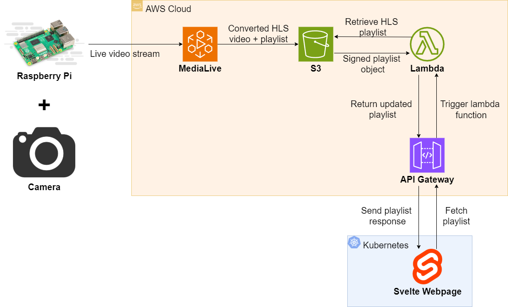

# Raspberry Pi Surveillance System

This is a Raspberry Pi-based surveillance system that streams live video captured from a raspberry pi to a Svelte webpage hosted on Kubernetes. The Raspberry Pi sends a live video stream to AWS MediaLive, which converts the raw video into HLS (HTTP Live Streaming) format, generating video chunks and playlists. These HLS resources are stored in an AWS S3 bucket. To securely retrieve and stream the video, a Lambda function dynamically generates signed URLs for the HLS playlist and its associated chunks. These signed URLs are then exposed through an API Gateway, which serves as the backend endpoint for the frontend application.

---

## Directory Structure

- **client/**: Svelte web interface
- **manifests/**: Kubernetes manifests
- **misc/**: Other related files
- **server/**: Express.js server on Raspberry Pi

## Architecture Diagram

